# PRÁCTICA 3.2: DESPLIEGUE DE APLICACION CON NODE EXPRESS

En primer lugar, y tras haber usado tomcat9 en la práctica anterior deberemos desactivarlo de nuestro equipo, ya que este puede causar incompatibilidad con Node.

## Instalación de Node.js, Express y test de la primera aplicación

En primer lugar y sin extendernos mucho procederemos a instalar Node.js de la siguiente manera:

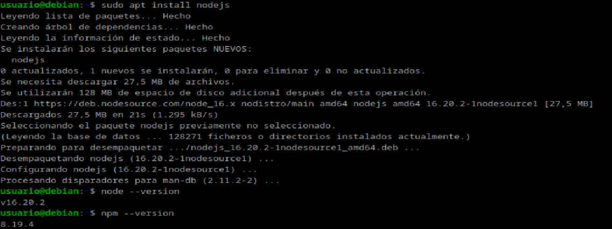

Y ahora instalamos Express.js y creamos un un proyecto de prueba:

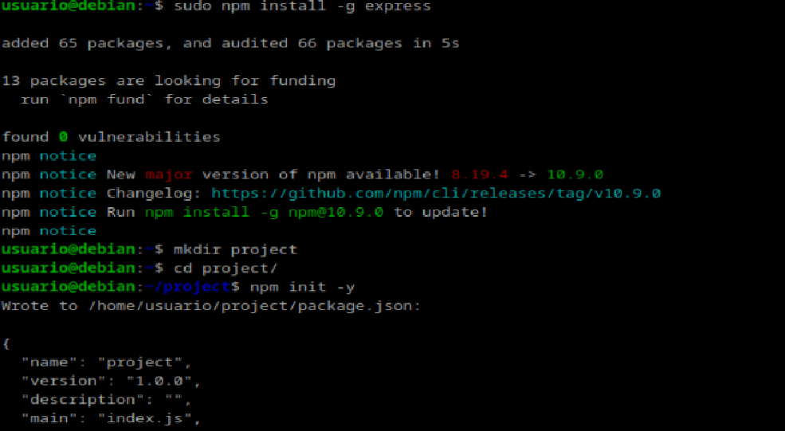

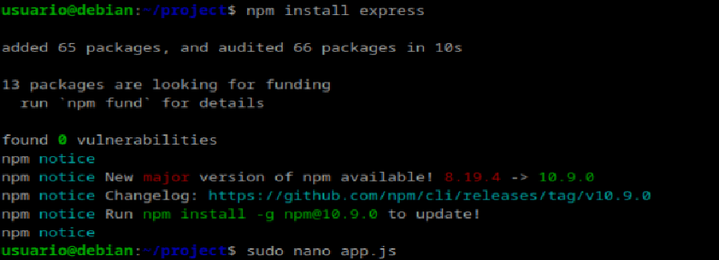

Y cambiamos localhost por nuestra ip:

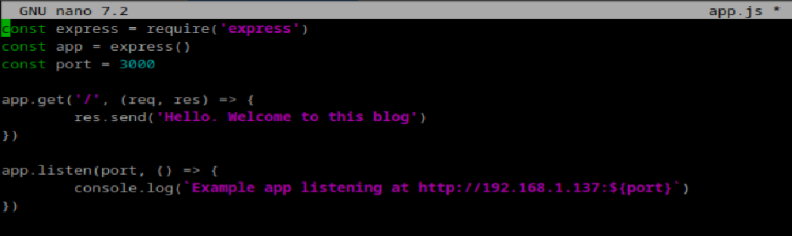

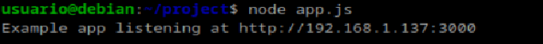

Nos dirigimos a la ip con el puerto 3000 y veremos lo siguiente:

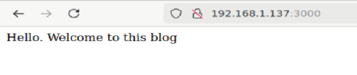

## Despliegue de una nueva aplicación

Ahora desplegaremos una aplicación ya creada. Clonamos el repositorio a nuestra máquina e instalamos las librerias:

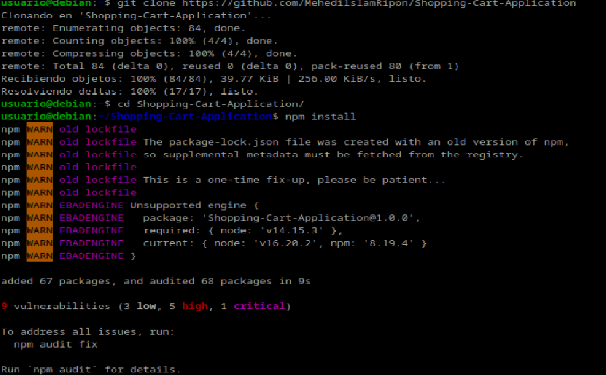

Por último iniciamos la aplicación

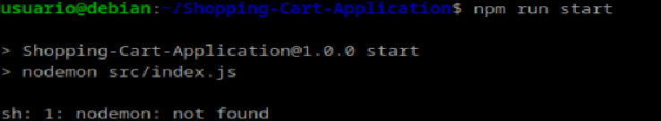

Como vemos nos ha soltado un error "sh: 1: nodemo: not found. Para solucionarlo debemos installar nodemon:

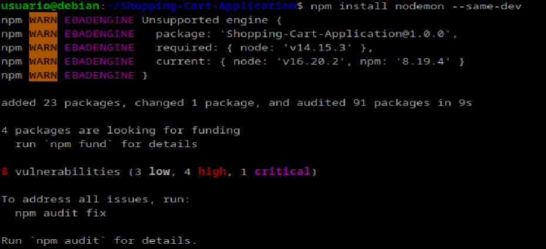

E iniciamos de nuevo:

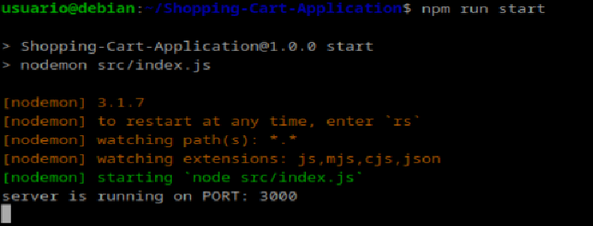

Ahora podremos visualizar lo sigueinte en nuestro navegador:

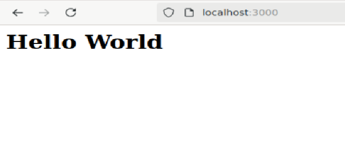

# PRÁCTICA 3.4: DESPLIEGUE DE UNA APLICACIÓN REACT EN NETLIFY (PaaS)

Nos logueamos con ssh en nuestra máquina debian

## Creación de nuestra aplicación

Creamos un directorio con 3 archivos: head.html, tail.html y aplicacion.js. Dentro del directorio creamos nuestra aplicación Node.js. Ejecutamos node aplicacion.js para ver que funciona correctamente:

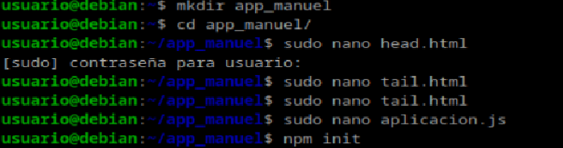

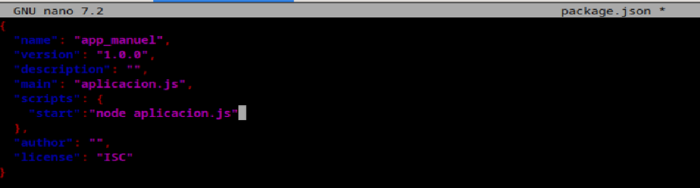

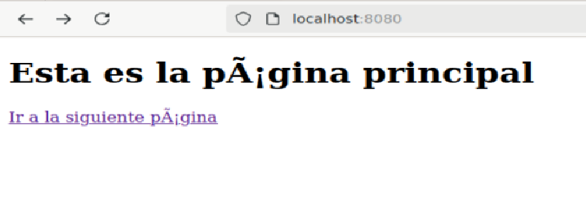

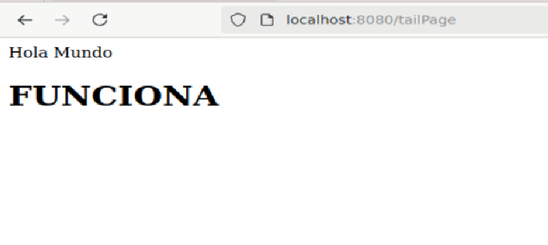

## Aplicación para Netlify

En primer lugar nos clonamos una aplicación creada con React a nuestra máquina:

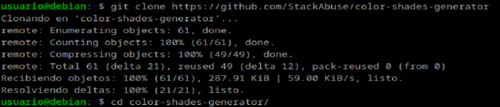

## Proceso de despliegue en Netlify

Antes de nada me he creado una cuenta en Netlify sin enlazar mi github.
Y a continuación instalamos el CLI de Netlify:

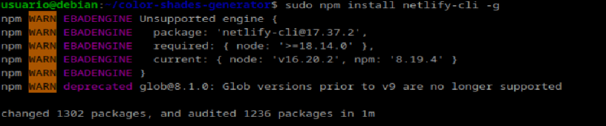

Desde la página de Netlify generamos un token que añadimos nuestra máquina:

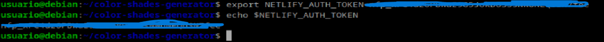

Y a continuación nos logueamos:

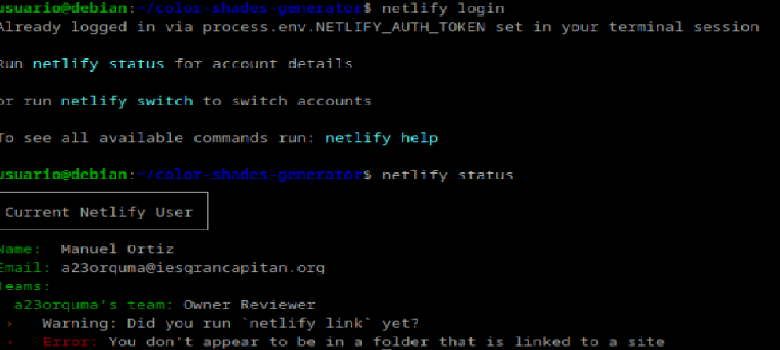

Como antes instalamos las dependencias y lo ejecutamos de la siguiente forma:

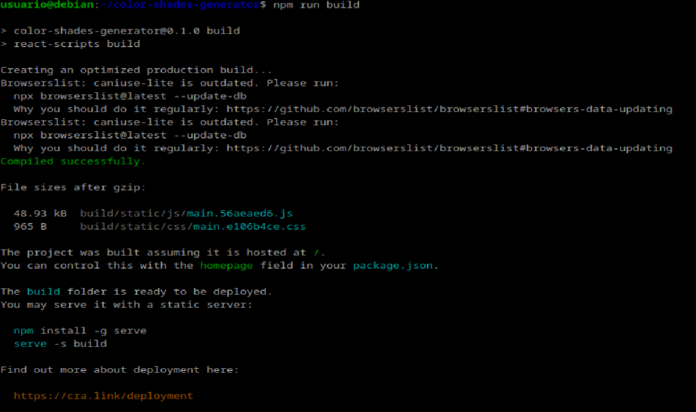

Y lo desplegamos:

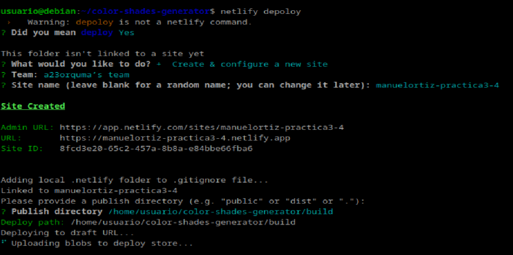

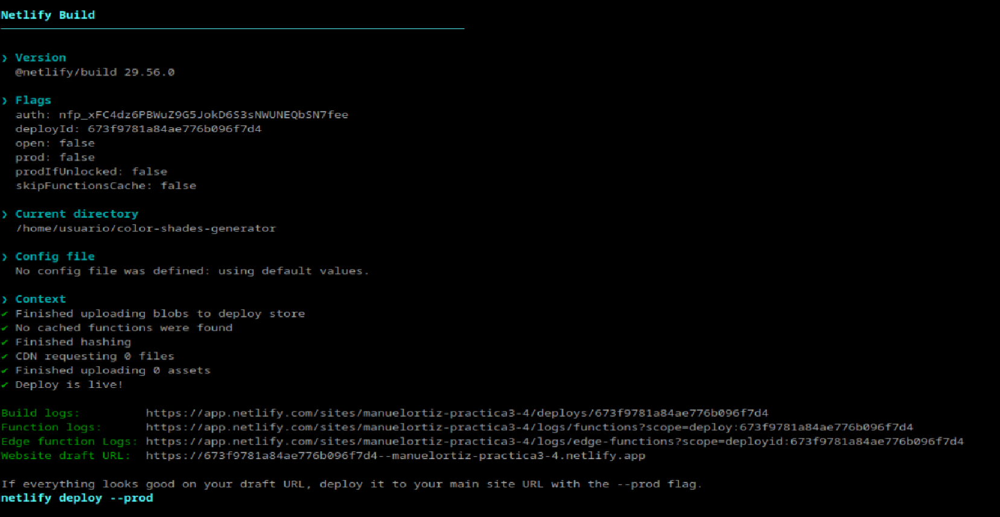

Ya desplegado, iremos al navegador e introduciremos la url que nos ha proporcionado:

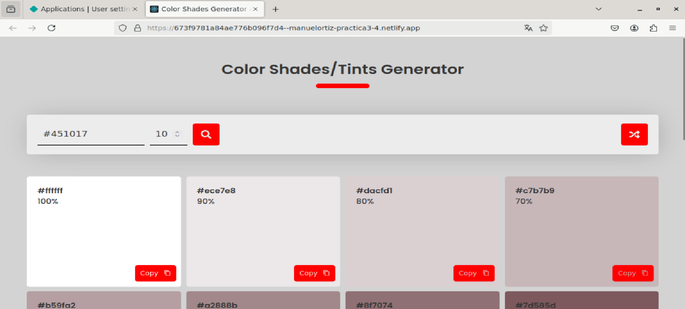

## Despliegue mediante conexión con Github.

Eliminamos el proyecto anterior tanto en local como en el servicio de Netlify:

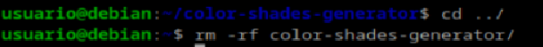

Creamos un repositorio en GitHub:

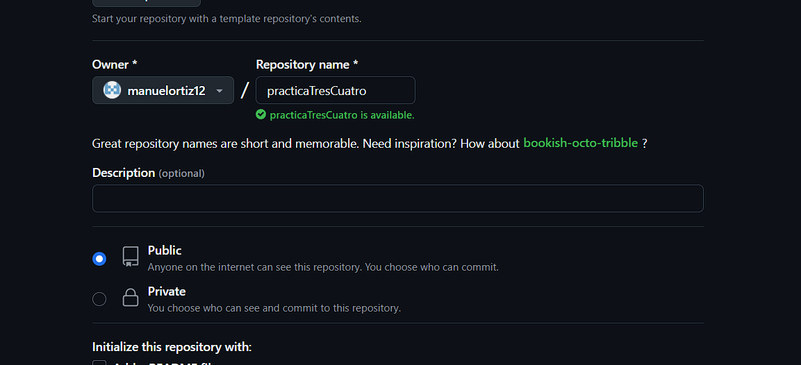

Descargamos un repositorio de GitHub:

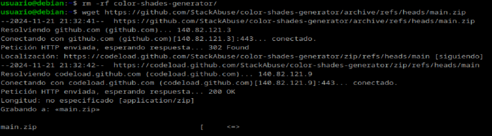

Lo descomprimimos en nuestro directorio:

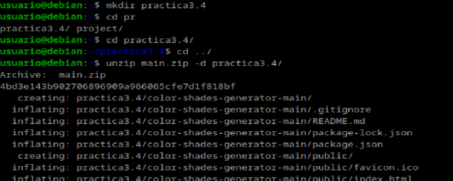

Y a continuación enlazamos el repositorio local con el que acabamos de crear en github y hacemos un push del contenido de este:

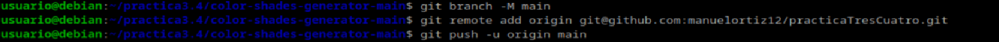

Ahora desde la página de Netlify, enlazamos nuestra cuenta de GitHub, seleccionamos nuestro repositorio y lo desplegamos:

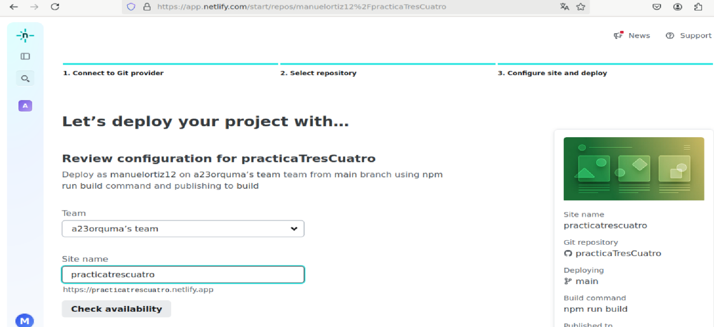

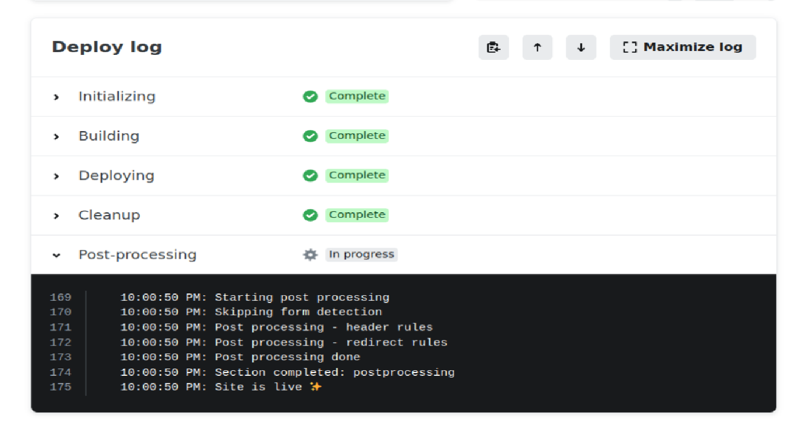

Ya desplegado, vamos a hacer un commit en nuestro repositorio de github y comprobaremos que se despliega el cambio automáticamente en Netlify. Para esto modificaremos el contenido del archivo robots.txt, donde añadiremos una carpeta con nuestro nombre:

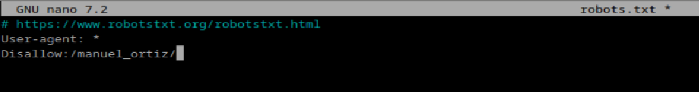

Ahora comprobamos Netlify, y veremos que se ha realizado un cambio con la fecha en la que hemos hecho el push del commit:

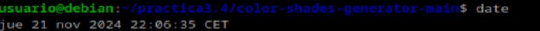

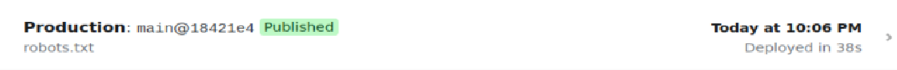

Y si nos dirigimos a la siguiente dirección comprobaremos que, efectivamente, se ha realizado el cambio:

